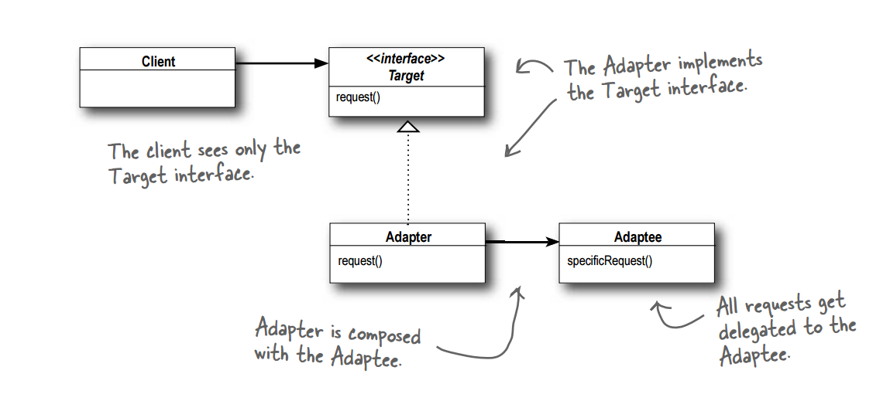

## 어댑터(Adapter) 패턴이란?

- 호환성이 없는 기존 클래스의 인터페이스를 변환하여 재사용 할 수 있게 해준다.
- 개방폐쇠 원칙(OCP)을 따른다.

## 어댑터(Adapter) 패턴 구조



1. **Client**에서 **Target interface**를 사용해 메소드를 호출함으로써 **Adapter**에 요청을 한다.
2. 어댑터에서는 **Adaptee** 인터페이스를 사용해 그 요청을 **Adaptee**에 대한 (하나 이상의) 메소드 호출로 변환한다.
3. 클라이언트에서는 호출 결과를 받긴 하지만 중간에 어댑터가 껴 있는지 알지 못한다.

## 어댑터(Adapter) 패턴 예시

**Client Class**

```java
public class Client {
	public void main(){
		Adaptee adaptee = new Adaptee();
		Target target = new Adapter(adaptee);
		target.method();
		...
	}
}
```

**Target Interface**

```java
public interface Target {
	public void method();
	...
}

```

**Adapter Class**

```java
public class Adapter implements Target {
	private Adaptee adaptee;

	public Adapter(Adaptee adaptee) {
		this.adaptee = adaptee;
	}

	@Override
	public void method() {
		this.adaptee.specific_method();
	}

	...
}

```

**Adaptee Class**

```java
public class Adaptee {
	public void specific_method(){
		...
	}
}
```

## INDEX

**서드파티(3rd party)**

하드웨어 생산자와 소프트웨어 개발자의 관계를 나타낼 때 사용한다.

그 중에서 **서드파티**는, 프로그래밍을 도와주는 라이브러리를 만드는 외부 생산자를 뜻한다.

- 하드웨어 생산자가 '직접' 소프트웨어를 개발하는 경우 : **퍼스트 파티 개발자 (1st party)**
- 하드웨어 생산자인 기업과 자사간의 관계(또는 하청업체)에 속한 소프트웨어 개발자 : **세컨드 파티 개발자 (2nd party)**
- 아무 관련없는 제3자 소프트웨어 개발자 : 서드 파티 개발자 **(3rd party)**
