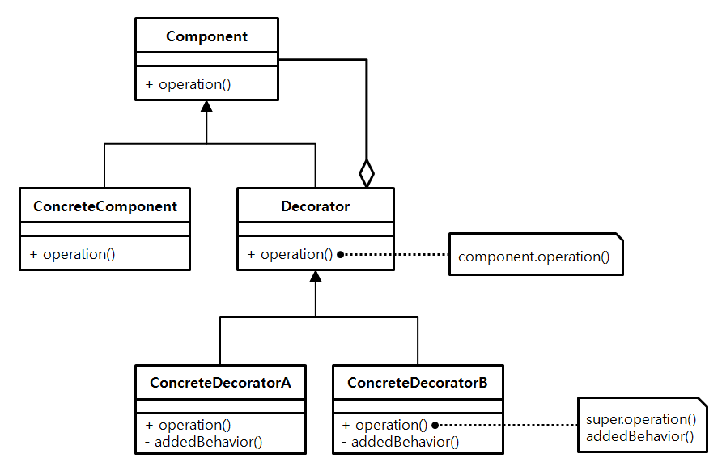

## 데코레이터(**Decorator**) 패턴

### 개념

- 데코레이터 패턴은 기본 객체에 추가적인 기능을 동적으로 유연하게 첨가하는 패턴이다.
- 객체가 상황에 따라 다양한 기능이 추가되거나 삭제되어야 할 때 사용한다.

### 장점

- 객체에 동적으로 기능 추가가 간단하게 가능하다.

### 단점

- 자잘한 데코레이터 클래스들이 계속 추가되어 클래스가 많아질 수 있다.
- 객체들이 겹겹이 둘러싼 구조가 되기 때문에 객체의 정체를 알기 힘들고 복잡해질 수 있다.

## 구조



- **Component**
  - ConcreteComponent 과 Decorator 가 구현할 인터페이스다.
  - 두 객체를 동등하게 다루기 위해 존재함
- **ConcreteComponent**
  - Decorate 를 받을 객체다.즉, 기능 추가를 받을 기본 객체
- **Decorator**
  - Decorate를 할 객체의 상위 클래스다.
  - 기능 추가 역할을 하는 객체는 이 객체를 상속받는다.
- **ConcreteDecorator**
  - Decorator 를 상속받아 구현할 기능 객체(1개 이상)이다.
  - 이 기능들은 ConcreteComponent 에 추가되기 위해 만들어 진다.

## 예시

### Component

```java
interface ChristmasTree {
  Stringdecorate();
}
```

### ConcreteComponent

```java
class DefaultChristmasTree implements ChristmasTree {
	@Override
	public String decorate() {
	return "Christmas tree";
  }
}
```

### Decorator

```java
class TreeDecorator implements ChristmasTree {

	private ChristmasTree christmasTree;

	public TreeDecorator(ChristmasTree christmasTree) {
		this.christmasTree = christmasTree;
  }

  @Override
	public Stringdecorate() {
		return christmasTree.decorate();
  }
}
```

### ConcreteDecorator

**Lights**

```java
class Lights extends TreeDecorator {

  public Lights(ChristmasTree christmasTree) {
		super(christmasTree); // 여기가 포인트.
  }

  public String addLights() {
		return " with Lights";
  }

  @Override
  public String decorate() {
		return super.decorate() + addLights(); // 여기가 포인트.
  }
}
```

**Flowers**

```java
class Flowers extends TreeDecorator {

  public Flowers(ChristmasTree christmasTree) {
super(christmasTree);
  }

  public String addFlowers() {
return " with Flowers";
  }

  @Override
  public String decorate() {
returnsuper.decorate() + addFlowers();
  }
}
```

### Client

```java
public class DecoratorDemo {

public static voidmain(String[] args) {
    ChristmasTree tree = new DefaultChristmasTree();
    System.out.println(tree.decorate());

    // Christmas tree + Lights
    ChristmasTree treeWithLights = new Lights(
			new DefaultChristmasTree()
    );
    System.out.println(treeWithLights.decorate());

    // Christmas tree + Lights + Flowers
    ChristmasTree treeWithLightsAndFlowers = new Flowers(
			new Lights(new DefaultChristmasTree())
		);
    System.out.println(treeWithLightsAndFlowers.decorate());
  }
}
```

**실행결과**

```
Christmas tree
Christmas tree with Lights
Christmas tree with Lights with Flowers
```
