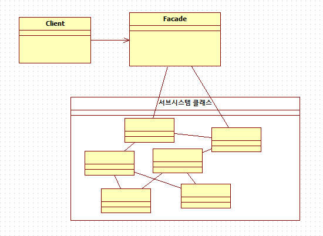

## 퍼사드(Facade) 패턴

### 개념

- 어떤 소프트웨어의 다른 커다란 코드 부분에 대한 간략화된 인터페이스를 제공하는 객체이다.
- 서브시스템과 상호작용 복잡도를 낮추기 위해 사용한다.

### 장점

- 퍼시드 클래스를 사용하면 서브 클래스의 로직을 몰라도 사용 가능
- Facade를 사용하여 시스템과 객체 간 종속성을 계층화 할 수 있다.

### 단점

- 클라이언트에게 서브시스템을 직접 사용하는 것을 막을 수 없다. (캡슐화 아니라는 소리)

## 구조



- **Facade**
  - 클라이언트의 요청을 적절한 서브시스템 클래스에 위임한다.
- **Subsystem classes**
  - 서브시스템 기능을 구현한다.
  - 서브시스템 클래스는 facade에 의해서만 사용된다.
- **Client**
  - Facade에게 특정 행동을 수행해 달라고 요청한다.

## 예시

### **Subsystem classes**

**interface**

```java
public interface Shape {
	void draw();
}
```

**classes**

```java
public class Rectangleimplements Shape {

  @Override
	public void draw() {
	  System.out.println("Rectangle::draw()");
  }
}
```

```java
public class Squareimplements Shape {

  @Override
	public void draw() {
    System.out.println("Square::draw()");
	}
}
```

```java
public class Circleimplements Shape {

  @Override
	public void draw() {
	  System.out.println("Circle::draw()");
  }
}
```

### Facade

```java
public class ShapeMaker {
	private Shape circle;
	private Shape rectangle;
	private Shape square;

	public ShapeMaker() {
    circle = new Circle();
    rectangle = new Rectangle();
    square = new Square();
	}

	public void drawCircle(){
    circle.draw();
  }
	public void drawRectangle(){
    rectangle.draw();
  }
	public void drawSquare(){
    square.draw();
  }
}
```

### Client

```java
public class FacadePatternDemo {
	public static void main(String[] args) {
		ShapeMaker shapeMaker =new ShapeMaker();

    shapeMaker.drawCircle();
    shapeMaker.drawRectangle();
    shapeMaker.drawSquare();
  }
}
```

### Result

```
Circle::draw()
Rectangle::draw()
Square::draw()
```
